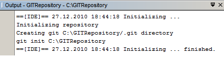
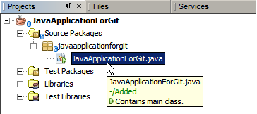
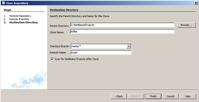
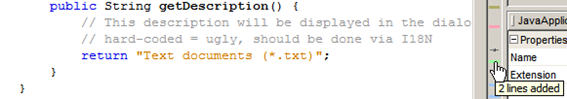

# Funcionamiento del entorno integrado NetBeans - Git

Apache NetBeans IDE proporciona soporte para el sistema de control de versiones de Git. Las funciones de Git del IDE le permiten realizar tareas de control de versiones directamente desde sus proyectos y código dentro del IDE. Este documento demuestra cómo realizar tareas de control de versiones en el IDE al guiarlo a través del flujo de trabajo estándar al usar Git.

Git es un sistema de control de versiones distribuido, gratuito y de código abierto, diseñado para manejar todo, desde proyectos pequeños a muy grandes, con velocidad y eficiencia. Cada clon de Git es un repositorio completo con historial completo y capacidades completas de seguimiento de revisiones, que no depende del acceso a la red o de un servidor central. La ramificación y la fusión son rápidas y fáciles de realizar. Git se utiliza para el control de versiones de archivos, al igual que herramientas como Mercurial, Subversion, CVS y Perforce.

## Inicializar un repositorio de Git

Para inicializar un repositorio de Git a partir de archivos existentes que aún no están en control de código fuente, debe completar los siguientes pasos:

1. En la ventana Proyectos, seleccione un proyecto sin versión y haga clic con el botón derecho en el nombre del proyecto.
2. En el menú contextual, seleccione **Versioning > Initialize GitRepository**(alternativamente, en el menú principal, seleccione **Team > Git > Initialize**).

3. Especifique la ruta al repositorio en el que va a almacenar sus archivos versionados en el **Initialize Git Repository** cuadro de diálogo o haga clic en Examinar y busque el directorio requerido.
4. Haga clic en Aceptar.

Se crea una subcarpeta **.git**  en la carpeta que especificó en el paso 1 anterior (su carpeta de proyecto NetBeans de forma predeterminada), que es su repositorio de Git donde se almacenan todos los datos de las instantáneas de su proyecto. Git comienza a crear versiones de todos los archivos en la carpeta que especificó. Puede abrir **Window > Output** para ver el informe de la IDE sobre el progreso de la creación del repositorio bajo el directorio de trabajo local.

Todos los archivos del proyecto están marcados **Add** en su árbol de trabajo. Para ver el estado de un archivo, coloque el cursor sobre el nombre del archivo en la ventana Proyectos. El estado del archivo en el árbol de trabajo se muestra en verde a la derecha de la barra, como se muestra en la siguiente imagen.

## Clonación de un repositorio de Git

Para obtener una copia de un repositorio de Git ya existente, debe clonarlo. Asegúrese de conocer la URL del repositorio de Git antes de iniciar el asistente de clonación del repositorio en el IDE.

Elija **Team > Git > Clone** desde el menú principal. Aparece el asistente Clonar repositorio.

1. En el apartado Repositorio, especifique la ruta a la ubicación del repositorio Git, el nombre de usuario y la contraseña/token (puede guardarlos para el futuro si es necesario).
2. (Opcional) Haga clic en Configuración de proxy para mostrar el cuadro de diálogo Opciones y establecer la configuración del servidor proxy. Haga clic en Aceptar cuando haya terminado.
3. Haga clic en Siguiente para pasar al siguiente paso del asistente.
4. En la página de Ramas Remotas, seleccione las ramas del repositorio que se van a buscar (descargar) en su repositorio local. Haga clic en Siguiente.

  

5. En la página Directorio de destino, especifique lo siguiente:
   * En el campo **Parent directory**, la ruta al directorio destinado al repositorio clonado en su disco duro (alternativamente, haga clic en el botón Examinar y navegue hasta el directorio). El campo Directorio principal está precargado con la ruta al NetBeansProjects directorio predeterminado donde se almacenan todos los proyectos de NetBeans.
   * En el campo **Clone Name**, el nombre de la carpeta local donde se clonará el proyecto original. De forma predeterminada, el nombre de clonación se completa con el nombre real del repositorio de Git.
   * En el campo **Checkout Branch**, seleccione la rama que se desprotegerá en el árbol de trabajo.
   * En el campo **Remote Name**, el nombre que representa el repositorio original que se está clonando. origin es el alias predeterminado del repositorio que se está clonando. Es un valor recomendado.
   * La casilla de **Scan form NetBeans Projects after clone** seleccionada para activar el análisis posterior justo después de que finalice la clonación. (El complemento busca proyectos de NetBeans en los recursos clonados y ofrece abrir los proyectos encontrados).
  
  
 
6. Haga clic en Finalizar. Después de clonar un repositorio de Git, .git se crea la carpeta de metadatos dentro de la carpeta que seleccionó en el asistente.

## Agregar archivos a un repositorio de Git

Para comenzar a rastrear un nuevo archivo y también para realizar cambios en un archivo ya rastreado en el repositorio de Git, debe agregarlo al repositorio.

Al agregar archivos a un repositorio de Git, el IDE compone y guarda instantáneas de su proyecto primero en el índice. Después de realizar la confirmación, el IDE guarda esas instantáneas en HEAD. El IDE le permite elegir entre los dos flujos de trabajo descritos en la siguiente tabla.

| Descripción del flujo de trabajo | Agregue explícitamente archivos nuevos o modificados al Índice y luego confirme solo aquellos que están en etapas en el Índice al HEAD| Omita la adición de archivos nuevos o modificados al índice y confirme los archivos necesarios directamente en HEAD.|
| ------------- | ------------- | ------------- |
| Pasos para seguir el flujo de trabajo  | 1. En la ventana Proyectos, haga clic con el botón derecho en el archivo que desea agregar. [inicio = 2]. En el menú contextual, elija Git > Add. Esto agrega el contenido del archivo al índice antes de enviarlo. [inicio = 3]. En la ventana Proyectos, haga clic con el botón derecho en el archivo que desea confirmar. [inicio = 4]. En el cuadro de diálogo Confirmar, seleccione el  botón de alternancia Cambios entre HEAD e Índice. Esto muestra la lista de archivos que ya están almacenados. [inicio = 5]. Confirme los archivos como se describe en la sección Confirmación de fuentes en un repositorio.| 1. En la ventana Proyectos, haga clic con el botón derecho en el archivo que desea confirmar.[inicio = 2]. En el menú contextual, elija Git > Commit.[inicio = 3]. En el cuadro de diálogo Commit, seleccione el  botón de alternancia Seleccionar los cambios entre HEAD y Working Tree. Esto muestra la lista de archivos que no están almacenados.[inicio = 4]. Confirme los archivos como se describe en la sección Confirmación de fuentes en un repositorio.|

`El estado del archivo en HEAD se muestra en verde a la izquierda de la barra, como se muestra en la siguiente imagen.`

## Editar archivos

Una vez que tenga un proyecto con versión de Git abierto en el IDE, puede comenzar a realizar cambios en las fuentes. Al igual que con cualquier proyecto abierto en NetBeans IDE, puede abrir archivos en el Editor de código fuente haciendo doble clic en sus nodos, tal como aparecen en las ventanas del IDE (por ejemplo, Proyectos (Ctrl-1), Archivos (Ctrl-2), Favoritos (Ctrl-3) ventanas).

Al trabajar con archivos de origen en el IDE, hay varios componentes de la interfaz de usuario a su disposición, que ayudan tanto en la visualización como en el funcionamiento de los comandos de control de versiones:

* Visualización de cambios en el editor de fuentes
* Visualización de información sobre el estado del archivo
* Deshaciendo cambios
  
### Visualización de cambios en el editor de fuentes

Cuando abre un archivo versionado en el editor de código fuente del IDE, puede ver los cambios en tiempo real que ocurren en su archivo a medida que lo modifica contra la versión base del repositorio de Git. Mientras trabaja, el IDE utiliza códigos de colores en los márgenes del Editor de fuentes para transmitir la siguiente información:

* **Azul**. Indica líneas que se han modificado desde la revisión anterior.
* **Verde**. Indica líneas que se han agregado desde la revisión anterior.
* **Rojo**. Indica líneas que se han eliminado desde la revisión anterior.

El margen izquierdo del editor de fuentes muestra los cambios que ocurren línea por línea. Cuando modifica una línea determinada, los cambios se muestran inmediatamente en el margen izquierdo.

Puede hacer clic en una agrupación de colores en el margen para llamar a los comandos de control de versiones. Por ejemplo, la siguiente imagen muestra los widgets disponibles al hacer clic en un icono rojo que indica que las líneas se han eliminado de su copia local:

El margen derecho del editor de fuentes le proporciona una descripción general que muestra los cambios realizados en su archivo en su totalidad, de arriba a abajo. La codificación de colores se genera inmediatamente cuando realiza cambios en su archivo.

**Nota** : Puede hacer clic en un punto específico dentro del margen para llevar su cursor en línea inmediatamente a esa ubicación en el archivo. Para ver la cantidad de líneas afectadas, pase el mouse sobre los íconos de colores en el margen derecho:

### Visualización de información sobre el estado del archivo

Cuando trabaja en las vistas Proyectos (Ctrl-1), Archivos (Ctrl-2), Favoritos (Ctrl-3) o Control de versiones, el IDE proporciona varias funciones visuales que ayudan a ver la información de estado de sus archivos. En el siguiente ejemplo, observe cómo la insignia (  ), El color del nombre del archivo y la etiqueta de estado adyacente coinciden entre sí para brindarle una manera simple pero efectiva de realizar un seguimiento de la información de versiones en sus archivos:

 Las insignias, la codificación de colores, las etiquetas de estado de los archivos y, quizás lo más importante, el visor de diferencias de Git contribuye a su capacidad para ver y administrar de manera efectiva la información de versiones en el IDE.

 #### Insignias y codificación de colores

Las insignias se aplican a los nodos de proyectos, carpetas y paquetes y le informan sobre el estado de los archivos contenidos dentro de ese nodo:

La siguiente tabla muestra el esquema de color utilizado para las insignias:
| componente de interfaz de usuario| Descripción|
|----------------------------------|-----------|
