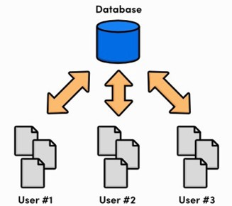
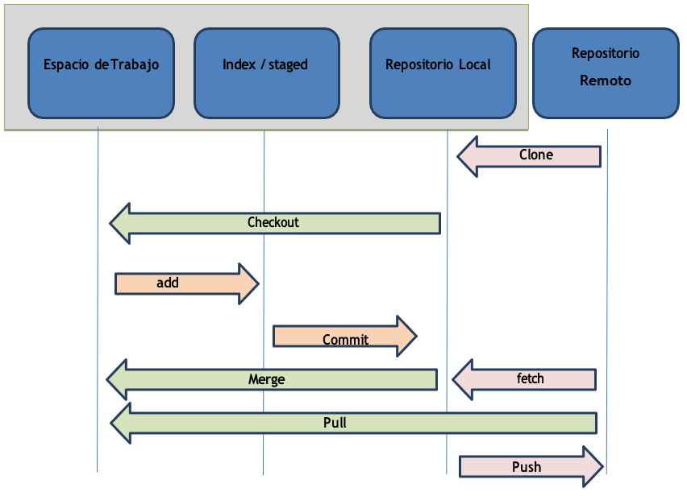

# UD3: Control de versiones

## Índice

  - [1. ¿Qué es el control de versiones?](#1-qué-es-el-control-de-versiones)
  - [2. Control de versiones en Java](#2-control-de-versiones-en-java)
  - [3. Git](#3-git)
    - [2.1. Funcionamiento de Git](#21-funcionamiento-de-git)
    - [3.2. Git en local](#32-git-en-local)
    - [3.3. Git en remoto](#33-git-en-remoto)
    - [3.4. Instrucciones Git](#34-instrucciones-git)
  - [4. GitHub](#4-github)

## 1. ¿Qué es el control de versiones?
Se llama __control de versiones__ a la gestión de los diversos cambios que se realizan sobre los elementos de algún producto o una configuración del mismo. Una versión, revisión o edición de un producto, es el estado en el que se encuentra el mismo en un momento dado de su desarrollo o modificación.

Aunque un sistema de control de versiones puede realizarse de forma manual, es muy aconsejable disponer de herramientas que faciliten esta gestión dando lugar a los llamados __sistemas de control de versiones__ o VCS (del inglés Version Control System). Estos sistemas facilitan la administración de las distintas versiones de cada producto desarrollado, así como las posibles especializaciones realizadas (por ejemplo, para algún cliente específico). Ejemplos de este tipo de herramientas son entre otros: CVS, Subversion, SourceSafe, ClearCase, Darcs, Bazaar, Plastic SCM, Git, SCCS, Mercurial, Perforce, Fossil SCM, Team Foundation Server.

Dentro de los VCS encontramos dos arquitecturas dependiendo de como se organice.
- __Arquitectura centralizada / cliente-servidor__: Un repositorio central al que se accede mediante un cliente en su máquina. Tiene un único servidor que contiene todos los archivos versionados, y varios clientes que descargan los archivos desde ese lugar central.

    

- __Arquitectura distribuida__: Cada usuario tiene su propio repositorio, por ello, cada vez que se descarga una versión del proyecto se hace una copia de seguridad completa de todos los datos. 
Así, si un servidor muere, cualquiera de los repositorios de los usuarios puede copiarse en el servidor para restaurarlo.
    
    

## 2. Control de versiones en Java
En los proyectos Java existen varios sistemas principales de control de versiones de código abierto:
- __CVS__ es una herramienta de código abierto que es usada por gran cantidad de organizaciones. 
- __Subversion__ es el sucesor natural de CVS, ya que se adapta mejor que CVS a las modernas prácticas de desarrollo de software. 
- __Git__ es un software de control de versiones diseñado pensando en la eficiencia, la confiabilidad y compatibilidad del mantenimiento de versiones de aplicaciones cuando estas tienen un gran número de archivos de código fuente. Profundizaremos más adelante.

## 3. Git
Git es un sistema de control de versiones distribuido gratuito y de código abierto diseñado para manejar todo tipo de proyectos con rapidez y eficiencia.

Git es fácil de aprender y ocupa poco espacio ofreciendo un rendimiento ultrarrápido. Supera a las herramientas de SCM como Subversion, CVS, Perforce y ClearCase con características como sucursales locales económicas, áreas de preparación convenientes y múltiples flujos de trabajo.

Git utiliza una arquitectura cliente-servidor: 
- Un servidor guarda la versión actual del proyecto y su historia, 
- Los clientes conectan al servidor para guardar una copia completa del proyecto, trabajar en esa copia y entonces ingresar sus cambios. 
- Típicamente, cliente y servidor conectan utilizando Internet, pero cliente y servidor pueden estar en la misma máquina. 

Puedes encontrar toda la documentación sobre git en su web [git-scm.com](https://git-scm.com/)

### 2.1. Funcionamiento de Git
Los tres estados en los que se pueden encontrar un archivo en Git son:
- __Commited__ (confirmado): Los datos están almacenados de forma segura en el repositorio local.
- __Modified__ (modificado): Has cambiado el archivo, pero no lo has confirmado en el repositorio.
- __Staged__ (preparado): Has marcado un archivo modificado en su versión actual para que vaya en el próximo commit o confirmación que hagas.

Esto nos lleva a las tres secciones principales de un proyecto de Git serán:
- __Git directory__ (directorio de Git). Contiene base datos objetos y metadatos del proyecto. Es la parte más importante de Git, es lo que copiamos cuando clonamos el repositorio desde otro ordenador.
- __Working directory__ (directorio de trabajo). Es una copia de una versión del proyecto para poder trabajar. Estos archivos se obtienen de la base de datos comprimida en el Git Directory y se guardan en nuestro equipo local para poder editarlos.
- __Staging area__ (área de preparación o índice). Es un archivo que está en nuestro directorio de Git y almacena la información sobre lo que va a ir en la próxima confirmación. 

### 3.2. Git en local
Teniendo en cuenta los tres estados y las tres secciones principales de Git, el flujo de trabajo nuestro será:
1)	Modificar archivos en nuestro Directorio de Trabajo.
2)	Preparas los archivos, añadiéndolos al Área de Preparación.
3)	Confirmar los cambios, que consistirá en coger los archivos tal y como están en el Área de preparación y almacenar las instantáneas de forma permanente en el directorio de Git.

Por lo que podemos decir que:
- Las versiones de los archivos que están en el Directorio de Git se consideran Commited (confirmadas).
- Si la versión ha sufrido cambios desde que se obtuvo el repositorio y han sido añadidas al Área de Preparación, se considera Staged (preparada).
- Si los cambios no se han añadido al Área de preparación, está Modified (modificada).

### 3.3. Git en remoto

Para trabajar con un repositorio remoto es necesario conocer varios conceptos:
- __Origin__: nombre por defecto del repositorio remoto principal.
- __Master /Main__: nombre de la rama principal que se crea por defecto.
- __Head__: El commit en el que está el repositorio actualmente, suele ser el último commit de la rama principal.

### 3.4. Instrucciones Git

- __checkout__: acción de actualizar parte o todo el árbol de trabajo con un objeto árbol o blob desde la base de datos de objeto, además actualiza el índice y la referencia HEAD si se ha cambiado de rama. Sirve para moverse entre ramas de un mismo proyecto
- __clone__: obtener una copia local completa de un repositorio git remoto.  Es normalmente el primer paso para traernos el repositorio remoto a nuestro equipo. Este comando sólo se ejecuta una vez.
- __add__: Añadir los ficheros que hayan sufrido algún cambio (nuevos, modificados o eliminados) a la fase de preparación o stage.
- __commit__: información de una revisión dada. Incluye: los padres del objeto, la persona que ha realizado el commit de la revisión, el autor de la revisión, la fecha de la misma, un mensaje asociado, el objeto tree que corresponde al directorio raíz de la revisión.
- __fetch__: obtener la cabeza de una rama (o varias) desde un repositorio remoto, copiando los objetos que falten y moviendo la(s) cabeza(s) remota(s).
- __pull__: hacer un fetch seguido de un merge, con una rama remota dada. Recibir los cambios del repositorio remoto. Es conveniente ejecutar este comando antes de realizar ningún cambio en el código para evitar conflictos.
- __push__: enviar los objetos de la rama local que no están en la rama remota a la que hace referencia el pull, y actualizar la cabeza de la rama remota. Es la acción complementaria de pull. Si la cabeza de la rama remota no es un ancestro de la cabeza de la rama local, el push falla*. Debemos especificar a que servidor remoto y que en rama queremos subirlos. git push origin master. Con el parámetro -u, indicaremos que ese es el server y la rama por defecto si no los especificamos. git push -u origin master. El servidor remoto recibe en el comando el nombre de origin y la rama por defecto es la rama master.

## 4. GitHub
GitHub es una plataforma de desarrollo colaborativo para alojar proyectos utilizando el sistema de control de versiones Git. Se utiliza principalmente para el desarrollo de software. El código de los proyectos alojados en GitHub se almacena generalmente de forma pública.

El objetivo de GitHub es facilitar el trabajo colaborativo, que es aquel en el cual un grupo de personas intervienen aportando sus ideas y conocimientos con el objetivo de lograr una meta común.
El grupo puede ser desde un reducido equipo de trabajo para un proyecto empresarial o académico hasta grupos inmensos que colaboran en proyectos masivos.

Puedes consultar más información sobre GitHub en su web [github.com](https://github.com/)

Ver vídeo explicativo del funcionamiento de GitHub: [What is GitHub?](https://www.youtube.com/watch?v=w3jLJU7DT5E)

