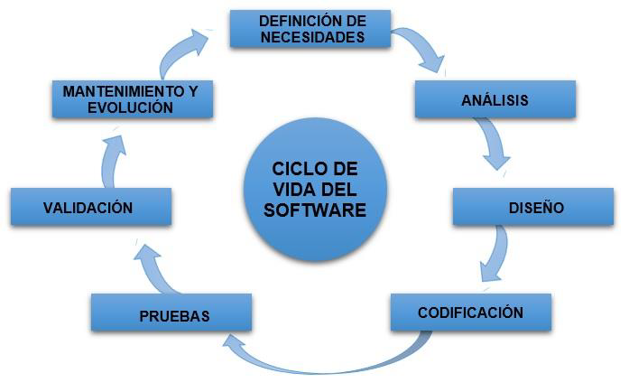

# UD4 - Diseño y realización de pruebas

- [UD4 - Diseño y realización de pruebas](#ud4---diseño-y-realización-de-pruebas)
  - [1. Introducción a las pruebas de software](#1-introducción-a-las-pruebas-de-software)
  - [2. Estrategia de las pruebas de software](#2-estrategia-de-las-pruebas-de-software)
    - [2.1. Pruebas unitarias](#21-pruebas-unitarias)
    - [2.2. Pruebas de integración](#22-pruebas-de-integración)
    - [2.3. Pruebas de sistema](#23-pruebas-de-sistema)
    - [2.4. Pruebas de validación](#24-pruebas-de-validación)
  - [3. Diseño de casos de prueba](#3-diseño-de-casos-de-prueba)
  - [4. Documentación de pruebas](#4-documentación-de-pruebas)
  - [5. Depuración](#5-depuración)
  - [6. Pruebas automáticas](#6-pruebas-automáticas)

## 1. Introducción a las pruebas de software
Las pruebas de software forman parte de una de las fases del ciclo de vida del software y tratan de detectar defectos cometidos en fases anteriores.

El objetivo de las pruebas de software es la validación y verificación del mismo. 
- **Validación**: se realiza al finalizar por completo el desarrollo para determinar si satisfacen los requisitos especificados. 
- **Verificación**: se realiza al final de cada fase para comprobar el cumplimiento de los requisitos de esa fase.

> **Ejemplo de la importancia de realizar pruebas de código**
> 
> ARIANE 5 es un cohete de un solo uso diseñado para colocar satélites en órbita geoestacionaria y para enviar cargas a órbitas bajas. El vuelo 501 (04/06/1996) fue la primera prueba de vuelo del sistema de lanzamiento del Ariane 5. Fracasó porque 37 segundos después del lanzamiento, la lanzadera explotó debido al mal funcionamiento del software de control. El motivo de la explosión fue un fallo de software, el módulo de control no se había probado lo suficiente.
>
> Vídeo: [TBT Launch: Ariane 5 Flight 501 (6-4-1996)](https://www.youtube.com/watch?v=fCnO-UYF3co).

Esisten dos aspectos a los que hay que prestar atención para realizar pruebas en el software, en ellos hay que considerar:
1. La **estrategia de aplicación de las pruebas**, donde se fijan los elementos que van testear. (Punto 2 de esta unidad)
2. Las **técnicas de diseño de casos de prueba** que se van a utilizar para cada uno de los elementos seleccionados. (Punto 3 de esta unidad)

Otro concepto importante relacionado con las pruebas de código es la **depuración**, que es el proceso de identificar y corregir errores de programación.​ Es conocido también por el término inglés _debugging_, cuyo significado es "eliminación de bugs", manera en que se conoce informalmente a los errores de programación.

## 2. Estrategia de las pruebas de software
Las pruebas siempre se empiezan porlas partes pequeñas de la aplicación y se va incrementando poco a poco el alcance. Las pruebas que se suelen realizar son unitarias, de integración, de sistema y de validación y suelen realizarse secuencialmente.

### 2.1. Pruebas unitarias
Las pruebas unitarias son las primeras a las que se somete nuestro software y prueban las clases u objetos de nuestro código. En programación orientada a objetos, además de las clases tendremos que probar los métodos individualmente.

### 2.2. Pruebas de integración
En las pruebas de integración se comprueba si las clases que forman nuestro programa funcionan correctamente cuando interactuan. Se pueden realizar siguiendo dos estrategias diferentes:
- Prueba basada en hebra: integra el conjunto de clases requeridas para responder a una entrada concreta.
- Prueba basada en uso: primero prueba el funcionamiento de las clases independientes y después el de las dependientes de las anteriores.

### 2.3. Pruebas de sistema
Las pruebas de sistema comprueban el funcionamiento de un sistema integrado de hardware y software para comprobar si cumplpe los requisitos especificados. Se comprueban los requisitos funcionales y no funcionales, la documentación de usuario y el rendimiento del programa.

Las pruebas de sistema se pueden agrupar en:
- **Pruebas de recuperación**: se fuerza un fallo en el sistema y se comprueba que se puede recuperar correctamente. Se realiza en sistemas que deben tolerar fallos y que requieran recuperaciones rápidas. 
- **Pruebas de seguridad**: tratan de encontrar lagunas de seguridad y proteger al sistema ante ataques imprevistos que podrían resultar en la pérdida de datos o información confidencial. 
- **Pruebas de esfuerzo**: ponen al sistema ante situaciones extremas para comprobar su funcionamiento. Se prueban, por ejemplo, situaciones que requieran la memoria máxima de la que dispone el sistema.
- **Pruebas de rendimiento**: se realizan en sistemas en los que, además de requisitos funcionales, se deben cumplir ciertos requisitos de rendimiento como por ejemplo un tiempo de respuesta máximo.
- **Pruebas de despliegue**: comprueban el funcionamiento del sistema en diferentes plataformas o equipos en los que se va a poder utilizar. Por ejemplo, una web debemos probarla en diferentes navegadores.

### 2.4. Pruebas de validación
El objetivo de las pruebas de validación es comprobar si el software es válido para el usuario y si está preparado para ser implementado en el entorno donde se va a usar.

Para considerar un programa como válido es importante tener claros los criterios de aceptación. Para ello es necesario fijar estos criterios en la ERS ( especificación de requisitos del sistema).

En las pruebas de validación participa el usuario final del producto y decide, junto al equipo de pruebas, si se ha alcanzado la versión final del software y si está listo para su explotación.

Para trabajar con la integración de las pruebas en el ciclo de vida se hace una modificación del modelo en cascada que conocemos como modelo en V. En este modelo se representan las fases de desarrollo de software junto a las de prueba.

## 3. Diseño de casos de prueba
Las técnicas de diseño de casos de prueba son las diferente metodologías que tenemos para generar pruebas a nuestro software en función del objetivo. Tenemos dos tipos principales de pruebas:
- **Pruebas de caja blanca** o pruebas estructurales: examinan el código fuente y su ejecución. Los casos de prueba se seleccionan en función del conocimiento que se tiene de la estructura del método y es necesario disponer del código fuente.
- **Pruebas de caja negra** o pruebas funcionales: estudian el sistema desde fuera. Los casos de prueba se basan en las especificaciones del módulo, por lo que no se requiere conocimiento de su estructura interna, no es necesario disponer del código fuente.

> Práctica 1: Pruebas estructurares o de caja blanca

> Práctica 2: caja negra

> Practica 3: combinar caja blanca y negra

## 4. Documentación de pruebas
Se deben documentar el diseño y el resultado de las pruebas, para ello se crean dos documentos:
- **Plan general de pruebas**: documento con la planificación de las pruebas que se van a realizar. Incluye el enfoque, los recursos necesarios, las actividades a realizar en las prueba, el personal responsable y los riesos asociados.
- **Especificación del diseño de las pruebas**: detalla el plan general de pruebas. Este documento incluye otros dos:
  - Especificaciones de casos de prueba: recoge los datos de entrada que se van a utilizar en cada prueba junto a los resultados esperados y las dependencias entre casos de prueba.
  - Especificaciones de procedimientos de prueba: fija los pasos a seguir para la ejecución de las pruebas.

## 5. Depuración

Dentro del ciclo de vida del software estamos en la fase de pruebas, justo después de codificación o implementación

En esta fase, una ejecución del software o de parte de él nos permite identificar y corregir errores de programación.

Así pues, __la depuración__ consiste en buscar y corregir errores que puede tener el código. 

Tenemos herramientas software que nos asisten en esta tarea. Se les suele llamar __depuradores__ y están, habitualmente, integrados en el IDE.

El depurador simula una ejecución real del software. En realidad se está ejecutando sobre una especie de máquina virtual que controla el estado de la memoria y del procesador virtual.

Estas herramientas nos van a permitir, entre otras cosas, parar la ejecución del software, ejecutarlo paso a paso, ver los valores de variables, objetos, etc.

Los pasos para realizar una depuración de código son:

* Ejecutaremos el código con todas las opciones posibles

* Anotaremos los problemas que surgen que pueden ser de dos tipos:

  * Errores funcionales (el programa no funciona o funciona mal).

  * Errores de coherencia con el diseño (el programa funciona pero no hace lo que debe hacer).

* Solucionamos los problemas

Para solucionar los problemas se recomienda seguir también una serie de pautas:

* Ejecutar el código en __modo debugging__ para poder utilizar las herramientas del IDE para depuración

* __Localizar__ el problema ¿En qué línea o zona del código se produce el error?

* Encontrar la __causa__ del problema ¿Porqué se produce el error?

* Encontrar la __solución__ del problema. Normalmente requerirá varias pruebas
  
Las utilidades que tienen las herramientas del IDE para depuración son:

* __Puntos de ruptura o breakpoints__: Se trata de puntos de interrupción de la ejecución del código que podemos colocar donde queramos.
Cuando el depurador llega a ese punto se detiene. Podemos colocar tantos punto de estos como queramos. Incluso,una vez parada la ejecución podemos reanudarla para que se haga solo una instrucción. De esta forma podemos ver que efecto tiene sobre el programa cada una de las líneas de código.
La ejecución se para en el primer breakpoint que hayamos colocado.
Tenemos varias utilidades para trabajar a partir de un breakpoint.

* __Watchpoints__: Permiten añadir una variable que no aparece en la ventana de variables para consultar su valor. Permite combinar variables con expresiones algebraicas.

* __Cambiar el valor de una variable__: Se puede modificar el valor de una variable de forma manual.

> Práctica 4: debugger

## 6. Pruebas automáticas

> Práctica 5: JUnit 5 
