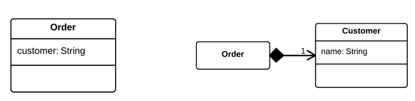
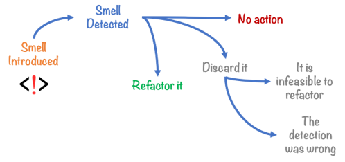

# UD5 - Optimización de código

- [UD5 - Optimización de código](#ud5---optimización-de-código)
  - [1. Refactorización](#1-refactorización)
    - [Convenciones y nomenclatura](#convenciones-y-nomenclatura)
      - [Ficheros:](#ficheros)
      - [Declaración de variables:](#declaración-de-variables)
      - [Nombres e identificadores](#nombres-e-identificadores)
    - [Técnicas de refactorización](#técnicas-de-refactorización)
    - [Malos olores (bad smells)](#malos-olores-bad-smells)
  - [2. Analizadores de código](#2-analizadores-de-código)


## 1. Refactorización

La __refactorización__ es una técnica de la ingeniería de software para reestructurar un código fuente, alterando su estructura interna sin cambiar su comportamiento externo.

El proceso de refactorizar busca mejorar nuestro código sin crear nuevas funcionalidades.

La idea es partir de código que está sucio y mejorarlo para conseguir que sea un código más limpio, que tenga un diseño más simple, que sea más fácil de arreglar y de modificar.

A lo largo del ciclo de vida de una aplicación es muy frecuente tener que realizar cambios por diferentes motivos. Estos cambios son parte del mantenimiento del código y se clasifican en tres grupos:
- Mantenimiento perfectivo: busca incorporar funcionalidades o requisitos pedidos por el cliente.
- Mantenimiento correctivo: busca corregir fallos detectados por el cliente tras la entrega del software.
- Mantenimiento adaptativo: tiene como objetivo que se pueda utilizar la aplicación en nuevos entornos de software o hardware.

Refactorizar nos ayuda a tener un código fuente sencillo y bien estructurado y facilita los mantenimientos.
<div class="page"/>

 Ejemplo
```Java
// sin aplicar refactorizacion
void printOwing(){
  printBanner();
  //print details
  System.out.println("name: "+name);
  System.out.println("amount:"+getOutstanding());
}
// este código esta desorganizado una posible solución refactorizando es: 
void printOwing(){
  printBanner();
  printDetails(getOutstanding());
}
void printDetails(double outstanding){
  System.out.println("name: "+name);
  System.out.println("amount:"+outstanding());
}
```
__Los principales objetivos__ de la refactorización son:
- Limpiar el código, mejorando la consistencia y la claridad.
- Facilitar el mantenimiento del código, sin corregir errores ni añadir funcionalidades.
- Eliminar código “muerto”.
- Facilitar el futuro mantenimiento y modificación del código.

Por el contrario, refactorizar:
- No consiste en depurar, el código debe estar en funcionamiento.
- No es lo mismo que optimizar, no busca mejorar el rendimiento del programa.

Al realizar refactorizacion se puede realizar de dos formas:
- __Refactorización continua__, la forma más adecuada de refactorizar. De esta forma realizaremos pequeñas refactorizaciones frecuentemente, de este modo desarrollaremos código limpio y optimizaremos el proceso de codificación.
- __Refactorización completa__. Se realiza cuando tenemos la aplicación desarrollada y no tenemos otra opción que refactorizar todo el código. 

### Convenciones y nomenclatura

Para conseguir un código límpio es necesario adaptarse a las normas del lenguaje de programación. Las convenciones de programación son un conjunto de directrices para un lenguaje de programación concreto que recomienda estilo, prácticas, y métodos de programación para cada aspecto de un programa escrito en cada lenguaje.

<div class="page"/>

#### Ficheros:

Los ficheros fuente de java son ficheros de texto plano cuyo nombre termina con la extensión .java. Dentro de cada fichero .java tenemos 4 partes en el siguiente orden:

- Comentarios sobre la clase (autor, fecha, licencias, etc)
- Sentencia package. Toda clase debe estar en un paquete.
- Sentencias import. Importar cada clase en una línea separada.
- La definición de una única clase o interface cuyo nombre es idéntico al nombre del fichero sin la extensión.

Dentro de la definición de la clase, se aplica el siguiente orden:

- Sentencia Class o Interface
- Variables de clase (static)
- Variables de instancia (Atributos de la clase)
- Constructores (Si hay sobrecarga deben ir seguidos)
- Métodos (Si hay sobrecarga deben ir seguidos)

#### Declaración de variables:

- Una única declaración por línea
  
```Java
int edad;
int cantidad;
```
- Las variables locales se deben inicializar en el momento de declararlas o justo después. Se declaran justo antes de su uso, para reducir su ámbito.
- Las variables de instancia o de clase se declaran al comienzo de la definición de la clase.
- Los arrays se pueden inicializar en bloque:
  
```Java
int[] array = { 0, 1, 2, 3 };
```
- Los arrays tienen los corchetes [ ] unidos a su tipo de datos:
```Java
String[] nombres; // correcto
String nombres[]; // incorrecto
```

#### Nombres e identificadores

Para los identificadores podemos usar las letras anglosajonas y números de la tabla ASCII. No se debe usar caracteres con tilde ni la (ñ). Las barras bajas o guiones tampoco se usan. 

- Los nombres de los identificadores deben ser siempre lo más descriptivos posible. Solo se usan identificadores de un solo carácter para representar los contadores del bucle for, comenzando por la letra i.
- Nombre de Package: siempre en minúsculas.
- Nombre de las clases o interfaces: _UpperCamelCase_.
- Nombre de los métodos: _lowerCamelCase_. Suelen ser verbos o frases.
- Nombres de constantes: CONSTANT_CASE. Todo el mayúsculas, separando con barra baja.
- Variables locales, atributos de la clase, nombres de parámetros: _lowerCamelCase_.

### Técnicas de refactorización

- __Tabulación__: _No_ es una técnica de refactorización en sí (ya que no se modifica código), pero es una forma de que el código sea más claro y legible.Sangrando o tabulando el código conseguimos una visión jerárquica del mismo por bloques.
```Java
// sin tabular
public class Pattern{
public static void main(String[] args){
char last='E',alphabet='A';
for (int i=1; i<=(last-'A'+1);++i){
for (int j=1; j<=i;++j){
System.out.print(alphabet+ " ");
}
++alphabet;
System.out.println();
}
}
}
//tabulado
public class Pattern{
  public static void main(String[] args){
    char last='E',alphabet='A';
    for (int i=1; i<=(last-'A'+1);++i){
      for (int j=1; j<=i;++j){
        System.out.print(alphabet+ " ");
      }
      ++alphabet;
      System.out.println();
    }
  }
}
```
- __Extraer método__ o también denominado __Sustituir bloques de código por un método__: Este patrón nos aconseja sustituir un bloque de código, por un método. De esta forma, cada vez que queramos acceder a ese bloque de código, bastaría con invocar al método. Es decir, cuando encontramos un fragmento de código que se puede agrupar. Lo incluimos dentro de un método propio indicando con su nombre la función que realiza.

<div class="page"/>

```Java
//sin refactorizar
void printOwing(){
  printBanner();
  //print details
  System.out.println("name: "+name);
  System.out.println("amount:"+getOutstanding());
}
// realizada la refactorización
void printOwing(){
  printBanner();
  printDetails(getOutstanding());
}
void printDetails(double outstanding){
  System.out.println("name: "+name);
  System.out.println("amount:"+outstanding());
}
```  
- __Renombrado (rename)__: Este patrón nos indica que debemos cambiar el nombre de un paquete, clase, método o campo, por un nombre más significativo.
  
```Java
int a = alto * ancho;       // sin refactorizar
int area = alto * ancho;    // factorizado
```
Además, hay que evitar los _Magic Numbers_. Un Magic Number es un valor literal (“texto” o numérico) empleado en el código sin ninguna explicación. Se deben sustituir siempre que se pueda por una constante que identifique su finalidad.

```Java
// Sin refactorizar:
int precioConIva = precioBase + (0.21 * precioBase);

//refactorizado:

final static double IVA = 0.21;
int precioConIva = precioBase + (IVA * precioBase);
```
También, separar variables temporales: Una variable intermedia temporal la estamos usando varias veces (es decir, para calcular varios valores intermedios diferentes). No siendo una variable dentro de un bucle.La solución es crear una variable para cada valor que se calcula e intentar que el nombre de esas variables intermedias corresponda con el sentido del valor calculado.

<div class="page"/>

```Java
//sin refactorizar
double temp = 2 * (alto + ancho);
System.out.println(temp);
temp = alto * ancho;
System.out.println(temp);

// refactorizado
final double perimetro = 2 * (alto + ancho);
System.out.println(perimetro);
final double area = alto * ancho;
System.out.println(area);
```
- __Eliminar asignaciones a parámetros__:Un método recibe parámetros. Este problema surge cuando uno de esos parámetros cambia de valor (porque se le modifica en el código) dentro del método.La solución pasa por utilizar una variable temporal.
```Java
//sin refactorizar
int discount(int inputVal, int quantity) {
  if (inputVal > 50) {
     inputVal -= 2;
    }
  //...
}
//refactorizado
int discount(int inputVal, int quantity) {
  int result = inputVal;
  if (inputVal > 50) {
    result -= 2;
  }
  //...
}
```
- __Mover método__:Un método está declarado en una clase, pero se usa más en otra.La solución es declarar el método en la clase qué más se use y en la clase en la que estaba inicialmente declarado, se puede hacer distintas cosas: declarar otro similar, dejar el código sin método si solo se usa una vez o borrarlo completamente si no se usa. 

```Java
//sin refactorizar
public class BankAccount
{
  ...
  public double CalculateInterestRate()
  {
  	if (CreditScore > 800)
	    return 0.02;
  }
}

public class AccountInterest
{
  ...
  public double InterestRate(){
    return Account.CalculateInterestRate(); 
  }
}
//refactorizado

public class BankAccount
{
  ...

}

public class AccountInterest
{
  …
  public double CalculateInterestRate()
  {
	  if (CreditScore > 800)
	    return 0.02;
  }
  public double InterestRate()
  {
	  return CalculateInterestRate(); 
  }
}
```
- __Descomponer un condicional__:Tenemos condicionales demasiado complejos con varias condiciones en una unidos por operadores lógicos. Solución, separar los condicionales o hacer un método que haga la comprobación y se vea más claro.

```Java
//sin refactorizar
if (date.before(SUMMER_START) || date.after(SUMMER_END)) {
  charge = quantity * winterRate + winterServiceCharge;
}
else {
  charge = quantity * summerRate;
}
//refactorizado
if (isSummer(date)) {
  charge = summerCharge(quantity);
}
else {
  charge = winterCharge(quantity);
}
```
- __Consolidar expresiones condicionales__:Varios condicionales nos llevan al mismo resultado. Solución: Combinarlos en una sola expresión.


```Java
//sin refactorizar
double disabilityAmount() {
  if (seniority < 2) {
    return 0;
  }
  if (monthsDisabled > 12) {
    return 0;
  }
  if (isPartTime) {
    return 0;
  }
  // compute the disability amount
  //...
}

//refactorizado
double disabilityAmount() {
  if (isNotEligableForDisability()) {
    return 0;
   }
  // compute the disability amount
  //...
}
```
- __Reemplazar condicional por polimorfismo__: Tenemos una expresión condicional usada para elegir entre tipos de un objeto para llevar a cabo comportamientos diferentes. La solución pasa por hacer la clase original abstracta y crear subclases de ella utilizando las características de la expresión condicional.
```Java
//sin refactorizar
class Bird {
  //...
  double getSpeed() {
    switch (type) {
      case EUROPEAN:
        return getBaseSpeed();
      case AFRICAN:       
        return getBaseSpeed() - getLoadFactor() * numberOfCoconuts;
      case NORWEGIAN_BLUE:
        return (isNailed) ? 0 : getBaseSpeed(voltage);
    }
    throw new RuntimeException("Should be unreachable");
  }
}
// refactorizado
abstract class Bird {
  //...
  abstract double getSpeed();
}
class European extends Bird {
  double getSpeed() {
    return getBaseSpeed();
  }
}
class African extends Bird {
  double getSpeed() {
    return getBaseSpeed() - getLoadFactor() * numberOfCoconuts;
  }
}
class NorwegianBlue extends Bird {
  double getSpeed() {
    return (isNailed) ? 0 : getBaseSpeed(voltage);
  }
}
```
- __Reemplazar array por objeto__:Un array que tiene distintos tipos de datos.Debemos crear un objeto con los datos del array.
```Java
//sin refactorizar
String[] row = new String[2];
row[0] = "Real Madrid";
row[1] = "15";
//refactorizado
Temporada row = new Temporada();
row.setNombre("Real Madrid");
row.setVictoria("15");
```
- __Mover la clase__: Si es necesario, se puede mover una clase de un paquete a otro, o de un proyecto a otro. La idea es no duplicar código que ya se haya generado. Esto impone la actualización en todo el código fuente de las referencias a la clase en su nueva localización. Ejemplo si una o varias clases tienen un mismo campo de datos. Dicho campo tiene un grupo de datos con significado propio y qué son agrupables. Solución: crearemos una clase con ese campo de datos.



- __Extract interface__: Crea un nueva interfaz de los métodos public non‐static seleccionados en una clase o interfaz. 

<div class="page"/>

```Java
//Sin refactorizar:
class Person {
  get officeAreaCode() {return this._officeAreaCode;}
  get officeNumber()   {return this._officeNumber;}

//Refactorizado:

class Person {
  get officeAreaCode() {return this._telephoneNumber.areaCode;}
  get officeNumber()   {return this._telephoneNumber.number;}
}
class TelephoneNumber {
  get areaCode() {return this._areaCode;}
  get number()   {return this._number;}
}
```
- __Mover del interior a otro nivel__: Consiste en mover una clase interna a un nivel superior en la jerarquía.
- __Borrado seguro__: Se debe comprobar, que cuándo un elemento del código ya no es necesario, se han borrado todas las referencias a él que había en cualquier parte del proyecto. 
- __Campos encapsulados__: Se aconseja crear métodos getter y setter, (de asignación y de consulta) para cada campo que se defina en una clase. Cuando sea necesario acceder o modificar el valor de un campo, basta con invocar al método getter o setter según convenga.
```Java
// sin refactorizar
class Persona {
  public String nombre;
}
//refactorizando
class Persona {
  private String nombre;
  public String getNombre() {
    return nombre;
  }
  public void setNombre(String nombre) {
    nombre = nombre;
  }
}
```
Hay muchas más tecnicas: Para más informacion:

> técnicas de refactorización en el [catálogo de Martin Fowler](https://refactoring.com/)
> Web con técnicas de refactorización [Source Making](https://sourcemaking.com/refactoring/refactorings)
> Web con técnicas de refactorización [Refactoring Guru](https://refactoring.guru/es/refactoring/techniques)

<div class="page"/>

### Malos olores (bad smells)

Los malos olores en el desarrollo de software es un síntoma en el código que indica que posiblemente exista un problema más profundo. Usualmente no se tratan de un bugs o errores de programación (no son técnicamente incorrectos y no impiden que el programa funcione correctamente). 



Detectar malos olores en el código es un motivo importante para realizar refactorización. Podemos organizar los bad smells según el nivel al que afectan:

Dentro de clases:
1. __Método extenso (Long method)__: La longitud del metodo hace mas dificil ver lo que hace.
2. __Lista de parametros extensa (Long parameter list)__: Pasar extrictamente lo necesario.
3. __Código duplicado (Ducplicate code)__: Obliga a hacer mantenimiento en varias partes.
4. __Clase extensa (Large class)__: Clase que esta tratando de hacer demasiadas cosas.
5. __Tipo incorporado en nombre (Type embedded in name)__: Redundancia en los nombres, clase.addListener(listener) por clase.add(listener).
6. __Nombre no comunicativo (Uncommunicative name)__: Colocar un nombre correcto que indique que es lo que se hace.
7. __Código muerto (Dead code)__: Variables, metodos, parametros, clases, fragmentos que no se usan en ninguna parte.
8. __Generalización especulativa (Speculative generality)__: No generalizar el código intentando predecir necesidades futuras.

Entre clases:
1. __Obsesión primitiva (Primitve obsession)__: Usar tipos primitivos para sustituir datos que pueden ser representados con una clase. Ej: Dinero (cantidad y moneda), teléfono (área y numero).
2. __Clase dato (Data class)__: Clases con solo getters y setters de atributos y sin comportamiento(anemic model).
3. __Grupo de datos (Data clumps)__: Grupos de atributos que siempre estan juntos en vez de agruparlos en una unica clase.
4.__Legado rechazado (Refused bequest)__: Subclases que no quieren o no necesitan todo lo que heredan. Es necesario heredar entonces?
5. __Intimidad inapropiada (Inappropriate intimacy)__: Dos clases se conocen demasiado.
6. __Clase perezosa (Lazy class)__: Clase que no hace lo suficiente.
7. __Envidia de características (Feature envy)__: Métodos que usan intensivamente otra clase que aquella a la que pertenecen.
8. __Cadena de mensajes (Message chains)__: Secuencia de llamadas extensa de un método a otro `obj.getAlgo().getOtraCosa().getOtroMas().esto().`
9. __Intermediario (Middle man)__: Cuando una clase delega su trabajo haciendo llamadas a otras clases. Entonces para que existe?
10. __Cambio divergente (Divergent change)__: Cambios hechos dentro de una clase que no tienen ninguna relación con las otras funcionalidades de la clase.
11. __Cirugía escopeta (Shotgun surgery)__: Cuando se cambia una clase y se produce una cascada de cambios en otras clases.
12. __Jerarquía de herencia paralela (Parallel Inheritance Hierarchies)__: Si al crear una subclase de la clase X es necesario hacer otra subclase de otra clase Y.

Hay muchos más "olores". Os invito a investigar en las webs:

> Web con malos olores [Source Making](https://sourcemaking.com/refactoring/smells)
> Web con más olores [Refactoring Guru](https://refactoring.guru/es/refactoring/smells)

Prácticas:

> Prácticas 1 y 2 : Refactorizar código aplicando las técnicas manualmente
> Práctica 3 : Refactorizar código con ayuda de NetBeans

## 2. Analizadores de código

Los analizadores de código son herramientas que realizan un análisis estático del código fuente. Estos analizadores evalúan el código fuente sin llegar a ejecutarlo. El objetivo es una mejora del código fuente sin modificar su comportamiento, que es exactamente el mismo fin que el de la refactorización. Sin embargo, en el caso de la refactorización, es el programador o la programadora quien debe detectar los síntomas de código mejorable (bad smells) y aplicar, entonces, el patrón de refactorización que permite eliminar esos síntomas. Los analizadores de código automáticamente detectan los síntomas y aportan también de foma automática una solución que la persona encargada de la programación puede decidir si aplicar o no.

Los analizadores de código realizan un ánalisis léxico y sintáctico del código fuente y si detectan que este es mejorable, lo indicarán y propondrán la manera de realizar la mejora.

La función principal de los analizadores de código es encontrar porciones de código que puedan generar efectos adversos como:

* Reducir el rendimiento
* Provocar errores
* Crear problemas de seguridad
* Tener una excesiva complejidad
* Complicar el flujo de datos
  
Los analizadores de código son herramientas automáticas que realizan un análisis estático del código fuente con el fin de detectar deficiencias en este y proponer mejoras, para lo que se basan en una serie de reglas predefinidas. Si el análisis del código es realizado de manera manual por parte de una persona, recibe más bien el nombre de comprensión de programas o revisión de código.

Por un lado, existen analizadores de código gratuitos y de pago y, por otro lado, de código abierto y de código cerrado.

NetBeans incluye un [Analizador de código](https://netbeans.apache.org/kb/docs/java/editor-inspect-transform.html) que es capaz de detectar errores comunes de programación como:

* Variables, métodos y parámetros no utilizados.
* Bloques vacíos de sentencias catch, try, finally, switch, etc.
* Expresiones lógicas que se pueden simplificar.
* Código que no se ejecuta nunca porque es inalcanzable.
* Código dubplicado.  
  
> Práctica 4 : Analizar código con ayuda de NetBeans