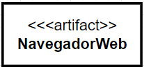
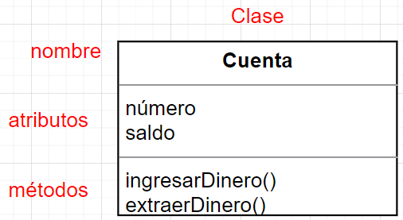

# UD6 - Elaboración de diagramas de clases

- [UD6 - Elaboración de diagramas de clases](#ud6---elaboración-de-diagramas-de-clases)
  - [1. Conceptos básicos de la orientación a objetos](#1-conceptos-básicos-de-la-orientación-a-objetos)
  - [2. UML](#2-uml)
    - [2.1 Elementos UML para diagramas de clases](#21-elementos-uml-para-diagramas-de-clases)
      - [Elementos estructurales](#elementos-estructurales)
    - [2.2 Diagramas UML](#22-diagramas-uml)
      - [Diagramas estructurales](#diagramas-estructurales)
      - [Diagramas de comportamiento](#diagramas-de-comportamiento)
        - [Diagramas de interacción.](#diagramas-de-interacción)
  - [3. Clases, atributos, métodos y visibilidad](#3-clases-atributos-métodos-y-visibilidad)
  - [4. Relaciones entre clases](#4-relaciones-entre-clases)
      - [4.1 Navegabilidad](#41-navegabilidad)
    - [4.2 Cardinalidad](#42-cardinalidad)
    - [4.3 Relación de herencia](#43-relación-de-herencia)
    - [4.3 Agregación y composición](#43-agregación-y-composición)
      - [4.4 Atributos de enlace](#44-atributos-de-enlace)
  - [5. Herramientas para la creación de diagramas de clases](#5-herramientas-para-la-creación-de-diagramas-de-clases)

El proceso de construcción de software tiene como finalidad solucionar problemas utilizando herramientas informáticas y, para obtener buenos resultados, requiere un proceso previo de análisis y especificación de requisitos. La programación orientada a objetos se enfoca en simular elementos de la realidad del problema de manera cercana a través de la abstracción de objetos. Estos objetos se caracterizan por tener un conjunto de atributos que los definen y un conjunto de operaciones que marcan su comportamiento.

## 1. Conceptos básicos de la orientación a objetos

Claves de la programación orientada a objetos:
- **Abstracción**: permite modelar la realidad mediante la creación de clases que capturan características y comportamientos similares.
- **Encapsulación**: reúne elementos relacionados en un mismo nivel de abstracción, aumentando la cohesión de los componentes del sistema.
- **Modularidad**: permite dividir una aplicación en partes independientes y reducir su complejidad.
- **Principio de ocultación**: limita el acceso a ciertas propiedades de los objetos, reduciendo la propagación de efectos colaterales cuando se producen cambios.
- **Herencia**: permite que los objetos utilicen las propiedades y comportamientos de otros objetos, formando una jerarquía.
- **Polimorfismo**: agrupa comportamientos diferentes bajo el mismo nombre, seleccionando uno u otro dependiendo del objeto que lo ejecute.
- **Recolección de basura**: se encarga de destruir automáticamente los objetos sin referencia, desvinculando su memoria asociada.

El paradigma de programación orientada a objetos tiene diversas **ventajas** en el desarrollo de software en comparación con otros paradigmas:

- Permite un desarrollo más rápido, económico y de mayor calidad gracias a la reutilización de código modular, lo que facilita la creación de aplicaciones similares y la reutilización de código.
- Mejora la calidad del sistema al hacerlo más extensible y permitir la fácil modificación de la funcionalidad de la aplicación a través de la modificación de operaciones.
- Es más fácil de modificar y mantener debido a la modularidad y encapsulación de objetos con responsabilidades independientes y claramente definidas.
- Facilita la adaptación y escalabilidad de las aplicaciones gracias a la capacidad de modificar la estructura y el comportamiento de los objetos sin tener que cambiar la aplicación completa.

## 2. UML
__UML__, o __Lenguaje Unificado de Modelado__, es un lenguaje gráfico respaldado por el [Object Management Group (OMG)](https://es.wikipedia.org/wiki/Object_Management_Group) que se utiliza ampliamente para visualizar, especificar, construir y documentar sistemas de software. Es el lenguaje en el que se describe el modelo y ofrece un estándar para describir el "plano" del sistema, incluyendo aspectos conceptuales y concretos.

UML es un "lenguaje de modelado" utilizado para especificar métodos y procesos en el desarrollo de software, y se puede aplicar en una gran variedad de metodologías de desarrollo. Sin embargo, UML no especifica en sí mismo qué metodología o proceso utilizar.

UML permite a los equipos de desarrollo visualizar el trabajo realizado en esquemas o diagramas estandarizados denominados modelos, que representan el sistema desde diferentes perspectivas. Al diseñar el modelo de un sistema utilizando UML, es importante seguir los siguientes principios básicos:
- La elección de qué modelos crear debe realizarse cuidadosamente, ya que esto influirá en cómo se aborda un problema y se da forma a la solución.
- Es posible expresar un modelo con diferentes niveles de precisión, lo que permite adaptarse a diferentes necesidades y situaciones.
- Los mejores modelos son aquellos que están estrechamente vinculados con la realidad del sistema que se está modelando.
- Es recomendable utilizar un conjunto de modelos casi independientes y desde múltiples puntos de vista para abordar cualquier sistema complejo, ya que un único modelo o vista no es suficiente.

### 2.1 Elementos UML para diagramas de clases
En el lenguaje UML podemos encontrar cuatro tipos de elementos, pueden ser estructurales, de comportamiento, de agrupación o de anotación. A continuación se explican los elementos de UML más importantes junto a su representación.

#### Elementos estructurales
Los elementos estructurales de un modelo son su parte estática y representan conceptos o cosas materiales. Son elementos estructurales: 
- Clase: describe un grupo de objetos que comparte atributos, operaciones, relaciones y semántica.

- Interfaz: colección de operaciones que especifican un servicio de una clase o componente. Describe el comportamiento de un elemento visto desde el exterior del mismo. Una interfaz especifica el nombre de las operaciones, los datos que hay que proporcionarle y los datos que devuelven, pero no concreta cómo se realizan dichas operaciones ni cómo se implementan. 

- Artefacto: es la especificación de un componente físico de información que es usado o producido por un proceso de desarrollo de software, o por el desarrollo y operación de un sistema. 

- Nodo: es un elemento físico que representa un recurso computacional, por ejemplo, un servidor web. Se representa con un cubo sobre el que se escribe el recurso que representa.

### 2.2 Diagramas UML

#### Diagramas estructurales
Los diagramas estructurales muestran la estructura estática del sistema y sus partes en diferentes niveles de abstracción. Existen un total de siete tipos de diagramas de estructura:

- Diagrama de clases: Muestra la estructura del sistema, subsistema o componente utilizando clases con sus características, restricciones y relaciones: asociaciones, generalizaciones, dependencias, etc.
- Diagrama de componentes: Muestra componentes y dependencias entre ellos. Este tipo de diagramas se utiliza para el desarrollo basado en componentes (CDB), para describir sistemas con arquitectura orientada a servicios (SOA).
- Diagrama de despliegue: Muestra la arquitectura del sistema como despliegue (distribución) de artefactos de software.
- Diagrama de objetos: Un gráfico de instancias, incluyendo objetos y valores de datos. Un diagrama de objeto estático es una instancia de un diagrama de clase; muestra una instantánea del estado detallado de un sistema en un punto en el tiempo.
- Diagrama de paquetes: Muestra los paquetes y las relaciones entre los paquetes.
- Diagrama de perfiles: Diagrama UML auxiliar que permite definir estereotipos personalizados, valores etiquetados y restricciones como un mecanismo de extensión ligero al estándar UML. Los perfiles permiten adaptar el metamodelo UML para diferentes plataformas o dominios.
- Diagrama de estructura compuesta: Muestra la estructura interna (incluidas las partes y los conectores) de un clasificador estructurado.

#### Diagramas de comportamiento
A diferencia de los diagramas estructurales, muestran como se comporta un sistema de información de forma dinámica. Es decir, describe los cambios que sufre un sistema a través del tiempo cuando está en ejecución. Hay un total de siete diagramas de comportamiento, clasificados de la siguiente forma:

- Diagrama de actividades: Muestra la secuencia y las condiciones para coordinar los comportamientos de nivel inferior, en lugar de los clasificadores que poseen esos comportamientos. Estos son comúnmente llamados modelos de flujo de control y flujo de objetos.
- Diagrama de casos de uso: Describe un conjunto de acciones (casos de uso) que algunos sistemas o sistemas (sujetos) deben o pueden realizar en colaboración con uno o más usuarios externos del sistema (actores) para proporcionar algunos resultados observables y valiosos a los actores u otros interesados ​​del sistema(s).
- Diagrama de máquina de estados: Se utiliza para modelar el comportamiento discreto a través de transiciones de estados finitos. Además de expresar el comportamiento de una parte del sistema, las máquinas de estado también se pueden usar para expresar el protocolo de uso de parte de un sistema.

##### Diagramas de interacción.
Es un subconjunto de los diagramas de comportamiento. Comprende los siguientes diagramas:

- Diagrama de secuencia: Es el tipo más común de diagramas de interacción y se centra en el intercambio de mensajes entre líneas de vida (objetos).
- Diagrama de comunicación: Se enfoca en la interacción entre líneas de vida donde la arquitectura de la estructura interna y cómo esto se corresponde con el paso del mensaje es fundamental. La secuencia de mensajes se da a través de una numeración.
- Diagrama de tiempos: Se centran en las condiciones que cambian dentro y entre las líneas de vida a lo largo de un eje de tiempo lineal.
- Diagrama global de interacciones: Los diagramas global de interacciones brindan una descripción general del flujo de control donde los nodos del flujo son interacciones o usos de interacción.

## 3. Clases, atributos, métodos y visibilidad

Los propósitos de una clase son definir las abstracciones y favorecer la modularidad. Una clase se describe por un conjunto de elementos que se denominan miembros y que son:
- Nombre.
- Atributos: conjunto de características asociadas a una clase. Pueden verse como una relación binaria entre una clase y cierto dominio formado por todos los posibles valores que puede tomar cada atributo. Cuando toman valores concretos dentro de su dominio definen el estado del objeto. Se definen por su nombre y su tipo, que puede ser simple o compuesto como otra clase.
- Protocolo: Operaciones (métodos, mensajes) que manipulan el estado. Un método es el procedimiento o función que se invoca para actuar sobre un objeto. Un mensaje es el resultado de cierta acción efectuada por un objeto. Los métodos determinan como actúan los objetos cuando reciben un mensaje, es decir, cuando se requiere que el objeto realice una acción descrita en un método se le envía un mensaje. El conjunto de mensajes a los cuales puede responder un objeto se le conoce como protocolo del objeto.

La información sobre las clases se representa mediante diagramas de clases utilizando notación UML. Cada clase se representa mediante un restánculo con tres zonas:
- En la zona superior se indica el nombre de la clase.
- En la zona central se incluye la información sobre los atributos de la clase.
- En la zona inferior se incluye la información sobre los métodos de la clase.

Al inicio del diseño de software no es necesario incluir toda la información en los diagramas UML pero según avanza el proceso de diseño se va añadiendo información a las clases que forman el sistema. Entre la información que se puede añadir a una clase encontramos el modificador de acceso para cada atributo y el tipo de dato.

Se pueden establecer diferentes niveles de encapsulación para los atributos y métodos de una clase en función del acceso que queremos darle a cada uno:

| Visibilidad | Significado | Java    | UML     | 
| ----------- | ----------  | ------- | ------- |
| Pública | Se puede acceder desde cualquier lugar. | public    | +     | 
| Protegida | Se puede acceder desde la propia clase o desde otra que herede de ella. | protected    | #     | 
| Por defecto | Se puede acceder desde cualquier clase en el mismo paquete. |       | ~     | 
| Privada | Se puede acceder desde la propia clase | private    | -     | 

La clase Cuenta anteriormente representada se puede modificar añadiendo la información de control de acceso y tipo de dato resultando:

## 4. Relaciones entre clases
Una relación es una conexión entre dos clases que incluimos en el diagrama cuando aparece algún tipo de relación entre ellas en el dominio del problema.

Se representan como una línea continua. Los mensajes "navegan" por las relaciones entre clases, es decir, los mensajes se envían entre objetos de clases relacionadas, normalmente en ambas direcciones, aunque a veces la definición del problema hace necesario que se navegue en una sola dirección, entonces la línea finaliza en punta de flecha.

Las relaciones se caracterizan por su cardinalidad, que representa cuantos objetos de una clase se pueden involucrar en la relación, y pueden ser:
- De asociación
- De herencia.
- De composición.
- De agregación.

El tipo de relación más sencilla es la de asociación, son clases que que no cumplen con las características de una herencia, composicion o agregación.

Es posible establecer relaciones unarias de una clase consigo misma. En el ejemplo se ha rellenado en la especificación de la relación los roles y la multiplicidad.

Una **clase de asociación** es una clase que forma parte de una relación de asociación entre otras dos clases. Se puede adjuntar una clase de asociación a una relación de asociación para proporcionar información adicional sobre la relación. Una clase de asociación es idéntica a otras clases y puede contener operaciones, atributos, así como otras asociaciones.

Por ejemplo, una clase llamada Estudiante representa a un estudiante y tiene una asociación con una clase llamada Curso, que representa un curso educativo. La clase Estudiante puede inscribirse en un curso. Una clase de asociación llamada Matrícula define aún más la relación entre las clases de Estudiante y Curso al proporcionar información de sección, calificación y semestre relacionada con la relación de asociación.

Como ilustra la siguiente figura, una clase de asociación está conectada a una asociación mediante una línea punteada.

#### 4.1 Navegabilidad

En relaciones de asociación, composición y agregación también se puede indicar su **navegabilidad**, esto indica mediante una flecha el sentido en el que se puede acceder a la información desde una de las clases que interviene. Por ejemplo, en el siguiente diagrama se muestra una asociación entre Cliente y Pedido navegable únicamente de Cliente a Pedido, esto indica que partiendo de un cliente podemos acceder a todos los pedidos que ha realizado.

### 4.2 Cardinalidad
La cardinalidad de una relación representa cuantos objetos de una clase se van a relacionar con objetos de otra clase. En una relación hay dos cardinalidades, una para cada extremo de la relación y pueden tener los siguientes valores:

| Cardinalidad | Significado |
| ------------ | ----------- | 
| 1            | una |  
| 0..1         | cero o una | 
| M..N         | de M a N  | 
| N            | N | 
| *            | de cero a varias | 
| 1..*         | de una a varias | 

Por ejemplo, la siguiente relación quiere decir que los alumnos se matriculan en los módulos, en concreto, que un alumno se puede matricular en uno a más módulos y que un módulo puede tener ningún alumno o varios.

En  este ejemplo vemos que un profesor puede impartir uno o varios módulos, mientras que un módulo es impartido sólo por un profesor.

En ocasiones se omite la cardinalidad, en esos casos se entiende que es un 1.

### 4.3 Relación de herencia

La herencia es una propiedad que permite a los objetos ser construidos a partir de otros objetos, es decir, la capacidad de un objeto para utilizar estructuras de datos y métodos presentes en sus antepasados.

El objetivo principal de la herencia es la reutilización, poder utilizar código desarrollado con anterioridad. La herencia supone una clase base y una jerarquía de clases que contiene las clases derivadas. Las clases derivadas pueden heredar el código y los datos de su clase base, añadiendo su propio código especial y datos, incluso cambiar aquellos elementos de la clase base que necesitan ser diferentes, es por esto que los atributos, métodos y relaciones de una clase se muestran en el nivel más alto de la jerarquía en el que son aplicables.

Tipos de herencia:
1.	Herencia simple: Una clase puede tener sólo un ascendente. Es decir, una subclase puede heredar datos y métodos de una única clase base.
2.	Herencia múltiple: Una clase puede tener más de un ascendente inmediato, adquirir datos y métodos de más de una clase.

La herencia se representa en el diagrama de clases como una asociación en la que el extremo de la clase base tiene un triángulo.

Ejemplo: Podemos utilizar la relación de herencia para crear una clase nueva que se llame Persona y que recoja las características comunes de profesor y alumno. Persona será la clase base y Profesor y Alumno las clases derivadas. 

Como los atributos Nombre, FechaNacimiento y correoElectronico se heredan de la clase base no hace falta que aparezcan en las clases derivadas, por lo que las hemos eliminado. Después podemos añadir atributos o métodos propios a las clases derivadas. 

### 4.3 Agregación y composición
Muchas veces una determinada entidad existe como un conjunto de otras entidades. En este tipo de relaciones un objeto componente se integra en un objeto compuesto. La orientación a objetos recoge este tipo de relaciones como dos conceptos: la agregación y la composición.

__La agregación__ es una asociación binaria que representa una relación todo-parte (pertenece a, tiene un, es parte de). Los elementos parte pueden existir sin el elemento contenedor y no son propiedad suya. Por ejemplo, un centro comercial tiene clientes o un equipo tiene unos miembros. El tiempo de vida de los objetos no tiene por qué coincidir.

En el siguiente caso, tenemos un ordenador que se compone de piezas sueltas que pueden ser sustituidas y que tienen entidad por sí mismas, por lo que se representa mediante relaciones de agregación. Utilizamos la agregación porque es posible que una caja, ratón o teclado o una memoria RAM existan con independencia de que pertenezcan a un ordenador o no.

__La composición__ es una agregación fuerte en la que una instancia ‘parte’ está relacionada, como máximo, con una instancia ‘todo’ en un momento dado, de forma que cuando un objeto ‘todo’ es eliminado, también son eliminados sus objetos ‘parte’. Por ejemplo: un rectángulo tiene cuatro vértices, un centro comercial está organizado mediante un conjunto de secciones de venta...

Para modelar la estructura de un ciclo formativo vamos a usar las clases Módulo, Competencia y Ciclo que representan lo que se puede estudiar en Formación Profesional y su estructura lógica. Un ciclo formativo se compone de una serie de competencias que se le acreditan cuando supera uno o varios módulos formativos.

Dado que si eliminamos el ciclo las competencias no tienen sentido, y lo mismo ocurre con los módulos hemos usado relaciones de composición. Si los módulos o competencias pudieran seguir existiendo sin su contenedor habríamos utilizado relaciones de agregación.

Estas relaciones se representan con un rombo en el extremo de la entidad contenedora. En el caso de la agregación es de color blanco y para la composición negro. Como en toda relación hay que indicar la cardinalidad.

#### 4.4 Atributos de enlace
Es posible que tengamos alguna relación en la que sea necesario añadir algún tipo de información que la complete de alguna manera. Cuando esto ocurre podemos añadir atributos a la relación mediante texto.

## 5. Herramientas para la creación de diagramas de clases
Existen muchas herramientas para crear diagramas de clases. Algunas de las más conocidas son:
- **draw.io**: Destaca por su sencillez. Simplemente accediendo a draw.io en el navegador tienes un lienzo vacío para comenzar a dibujar. Viene con formas para modelado UML básico, ER y BPMN. Se integra con Google Drive, Dropbox, OneDrive y otros sistemas para guardar automáticamente los modelos en la nube. Draw.io es de código abierto y se ha creado utilizando la biblioteca mxGraph.

> Actividad 1: relaciones entre clases.

> Actividad 2: creación de diagramas de clase.

> Actividad 3: generración de código a partir de diagramas de clases.

> Actividad 4: generación de diagramas de clases a partir de código.

